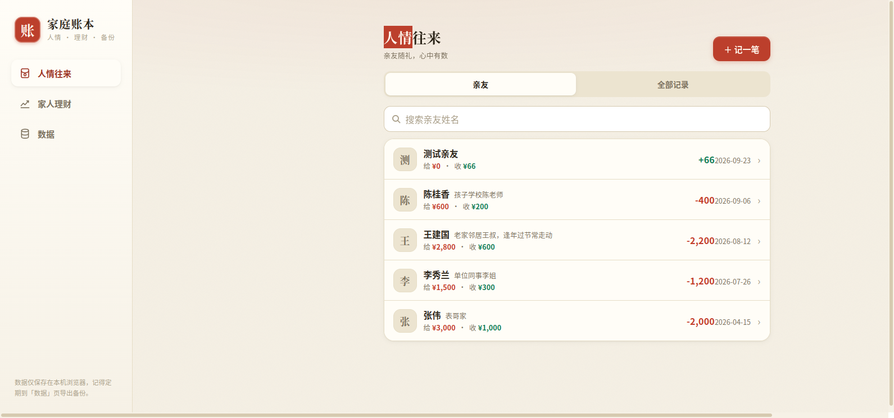

# AI 缺陷单助手

把杂乱、口语化的缺陷描述（测试反馈、聊天记录、故障复盘）粘贴进来，AI 流式整理为结构化缺陷单，并一键导出**走单文件**与**验证报告**草稿。



> ⚠️ 内置示例为完全虚构的数据，不涉及任何真实产品、客户或缺陷。请勿输入涉密单据内容。

## 为什么做这个

缺陷整理是一件重复且容易被敷衍的事：描述口语化、复现步骤缺失、级别随手填。这个工具把「读单 → 结构化 → 出草稿」交给 LLM，人只做最后的核对——**AI 起草，人负责**。

## 功能

- **流式解析**：SSE 逐块接收，实时展示 AI 原始输出，随时可取消（AbortController）
- 结构化字段：标题 / 严重级别 / 影响模块 / 复现步骤 / 实际与预期 / 修复建议 / 标签
- 一键导出 / 复制 Markdown 格式的「走单文件」与「验证报告」草稿
- **解析历史**：本地保存最近 20 条，可回看、回填、删除
- 兼容 OpenAI 协议的 LLM 服务（DeepSeek / 智谱 / Kimi / OpenAI…），Base URL 与模型可配置
- **纯前端、无后端**：API Key 只存浏览器 localStorage，单据内容直发 LLM 服务，不经任何中间服务器

## 技术栈

- Vue 3（Composition API + `<script setup>`）
- TypeScript（strict 模式）
- Vite + Vitest（22 个单元测试）
- GitHub Actions CI（test + typecheck + build）

## 架构

```
src/
├── App.vue                  # 编排层：状态管理、事件流转
├── components/
│   ├── ResultCard.vue       # 结果展示（纯展示组件，props 单向数据流）
│   ├── SettingsModal.vue    # LLM 服务配置（localStorage 持久化）
│   └── HistoryList.vue      # 解析历史列表
└── lib/
    ├── types.ts             # TicketInfo schema + 运行时校验（asTicketInfo）
    ├── llm.ts               # LLM 客户端：SSE 流式解析 / Abort 取消 / 自修复重试
    ├── history.ts           # 解析历史（localStorage，上限 20 条）
    ├── markdown.ts          # 走单文件 / 验证报告生成 + 文件名消毒 + Blob 下载
    └── demo.ts              # 虚构示例数据
    └── __tests__/           # 纯函数单元测试（校验器 / JSON 提取 / 导出格式）
```

### 四个值得说的设计

**1. 不信任 LLM 的输出。** LLM 返回的是「不可信输入」：`asTicketInfo()` 对每个字段做运行时校验与兜底（级别枚举白名单、非字符串与空白项过滤、空值降级），保证 UI 永远拿到合法的 `TicketInfo`。这套校验有 22 个单元测试盯着——测试还抓过一个真 bug：`''` 也是 string，最初的过滤器放过了空步骤。

**2. 解析失败自修复重试。** 从回复中提取 JSON（容忍 ``` 包裹与前后缀文字），解析失败时把**报错信息喂回对话**让模型自我修正，最多重试一次。

**3. SSE 流式 + 可取消。** `fetch` + `ReadableStream` 手写 SSE 解析（维护跨网络块的字节缓冲区，处理「半行」边界），`onDelta` 回调驱动打字机展示；`AbortSignal` 贯穿到 UI 取消按钮。

**4. 防御性文件名。** LLM 生成的模块名可能带 `/ : ?` 等字符，浏览器会当路径分隔符截断下载文件名——`sanitizeFilename()` 消毒并保证 `.md` 后缀。

## 本地运行

```bash
npm install
npm test         # 单元测试
npm run dev      # 开发
npm run build    # 类型检查 + 构建产物
```

首次使用：右上角「设置」→ 选服务商预设 → 填 API Key。

## License

MIT
